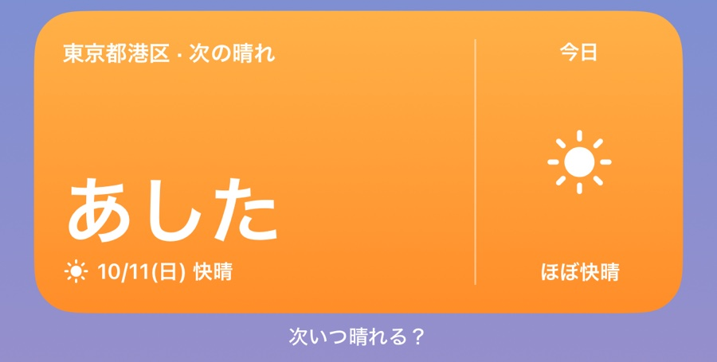
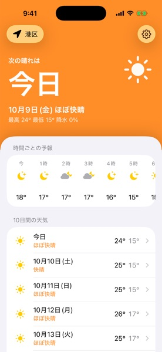
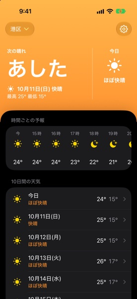
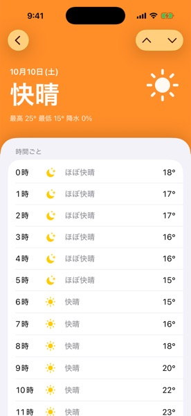
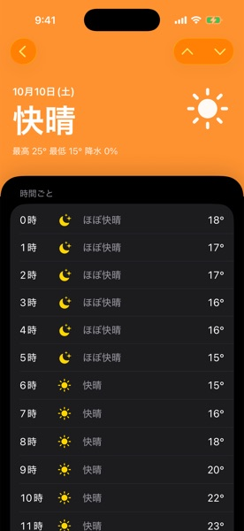
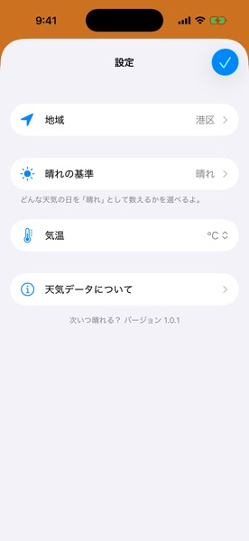
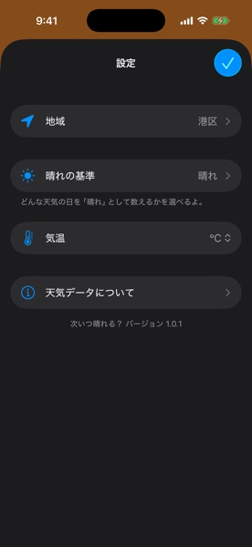
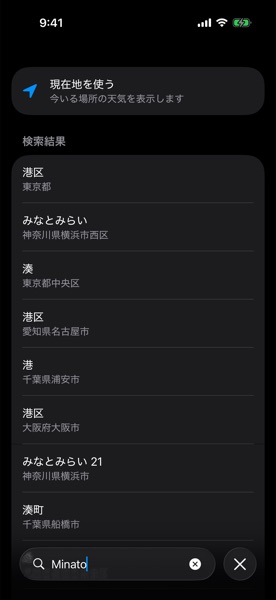

# 次いつ晴れる？ (Next Sunny Day)

[English](README.md)




次に晴れる日を、ホーム画面のウィジェットで確かめられる iOS アプリです。
天気アプリのウィジェットには今日と明日の天気しか出ず、洗濯物をいつ外に干せるかがわかりにくかったため作りました。
アプリでは、次の晴れの日に加えて、24 時間先までと 10 日間の天気を見られます。何を「晴れ」と数えるかも選べます。
日本語と英語に対応しています。

<a href="https://apps.apple.com/app/id1537055268" style="display: inline-block; overflow: hidden; border-radius: 13px; width: 250px; height: 83px;"></a>

## 開発

### 環境

| ツール | バージョン |
| --- | --- |
| Xcode | 26.4.1 |
| Swift | 6.3 (Swift 6 言語モード) |
| iOS | 26.0 以降 |

### 構成

| 項目 | 採用しているもの |
| --- | --- |
| UI | SwiftUI (Liquid Glass) |
| ウィジェット | WidgetKit (ホーム画面とロック画面) |
| 天気データ | WeatherKit |
| 場所の検索 | MapKit |
| モジュール | モジュールごとのローカル Swift パッケージ |
| 状態 | Observation (environment に置く `@Observable` の状態ホルダー) |
| 並行処理 | Swift 6、Approachable Concurrency |
| ローカルの保存 | App Group の `UserDefaults` + JSON ファイル |
| テスト | Swift Testing |
| 依存ライブラリ | なし (Apple のフレームワークのみ) |
| ブランチ | `main` のみ |

アーキテクチャの決定とその理由は [`docs/architecture/decisions/`](docs/architecture/decisions/) にあります。

### 仕組み

アプリは、選んだ地域と設定を `UserDefaults` に、取得した天気予報を JSON ファイルに保存します。保存先はどちらも、ウィジェットからも読める App Group のコンテナです。
予報は、アプリかウィジェットが直近の 4 時以降に取得していれば新しいものとみなします。アプリは、開いたときに予報が新しくなければ取得し、引っ張って更新したときにも取得します。
ウィジェットは保存された予報を表示し、1 日に 1 回、4 時過ぎに更新します。保存された予報が新しくなければ、ウィジェット自身が WeatherKit から取得します。
詳しくは [`docs/architecture/weather-fetch-flow.md`](docs/architecture/weather-fetch-flow.md) を見てください。

### ディレクトリ構成

```
NextSunnyDay/               # アプリ
├── App/                    # エントリポイント、AppFeatures、PreviewHost
├── SharedState/            # 画面間で共有する @Observable の状態ホルダー
├── Home/  DayDetail/  Onboarding/  Region/  Settings/
├── Components/
├── Resources/              # String Catalogs (.xcstrings)
└── Assets.xcassets
NextSunnyDayWidget/         # ウィジェット拡張
NextSunnyDayTests/          # アプリ層のテスト
Packages/
├── Core/                   # Weather, Location, PlaceSearch, AppGroup
└── Features/               # Region, Forecast, SunnyDay, Units
Tools/ImportCheck/          # import がすべて宣言済みの依存かを確かめる CI 用ツール
docs/                       # デザイン仕様、アーキテクチャの資料と ADR
```

## セットアップ

### リポジトリを clone する

```sh
$ git clone git@github.com:naipaka/NextSunnyDay-iOS.git
$ cd NextSunnyDay-iOS
```

### 天気データ

天気予報は [WeatherKit](https://developer.apple.com/weatherkit/) から取得します。ビルドに API キーは要りません。
実際の予報を取得するには、Certificates, Identifiers & Profiles で、アプリとウィジェットの App ID に WeatherKit の capability を、チームに WeatherKit の App Service を有効にしておく必要があります。自分のチームでビルドする場合は、バンドル ID を変えて、自分の App ID で有効にしてください。

### フォーマット

コードのフォーマットと lint には、Xcode 同梱の `swift-format` を `.swift-format` の設定で使います。CI では lint の警告があると失敗します。

```sh
$ xcrun swift-format format -i -r -p NextSunnyDay NextSunnyDayWidget NextSunnyDayTests Packages Tools
$ xcrun swift-format lint --strict -r -p NextSunnyDay NextSunnyDayWidget NextSunnyDayTests Packages Tools
```

### ビルドとテスト

`NextSunnyDay.xcodeproj` を Xcode で開き、アプリをビルドして実行してください。アプリのテストは `NextSunnyDay` スキームで実行します。各パッケージは Mac 上で単体でもテストできます。

```sh
$ for p in Packages/Core/* Packages/Features/* Tools/ImportCheck; do (cd "$p" && swift test); done
```

## スクリーンショット

| 画面 | Light | Dark |
| --- | --- | --- |
| ホーム |  |  |
| 日別詳細 |  |  |
| 設定 |  |  |
| 地域検索 |  |  |
| 天気データについて |  |  |
