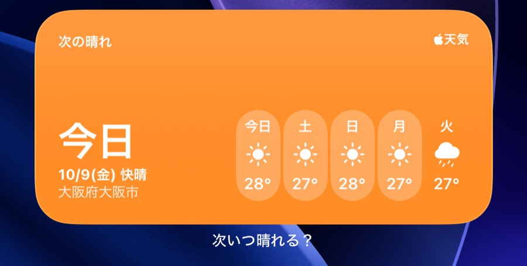
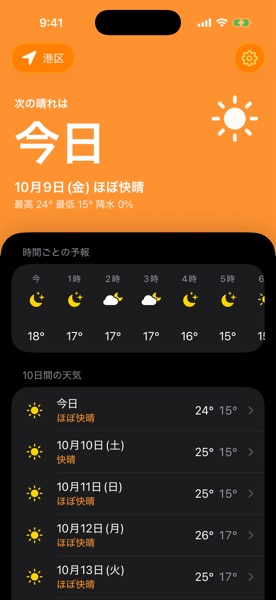
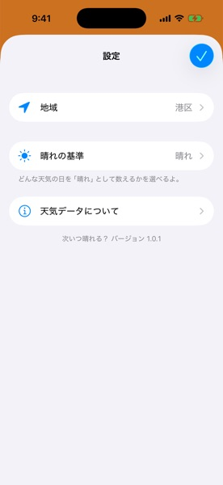
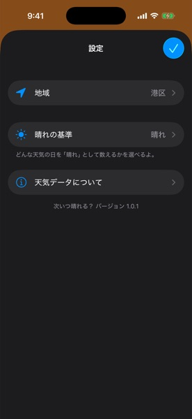
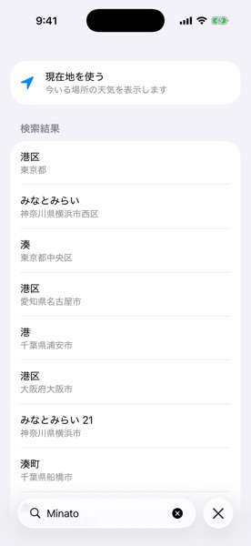
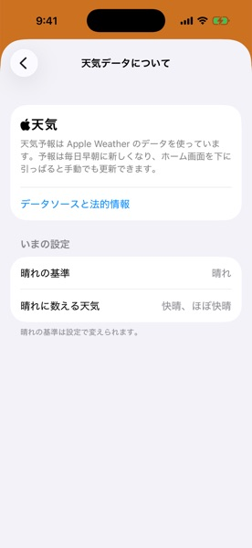
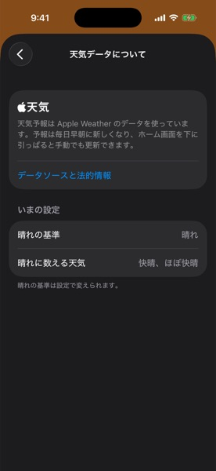

# Next Sunny Day (次いつ晴れる？)

[日本語](README.ja.md)




An iOS widget that shows the next sunny day on your home screen.
Weather widgets usually show only today and tomorrow, so it was hard to tell when you could hang your laundry outside.
The app shows when the next sunny day is, the next 24 hours and ten days, and lets you choose what counts as sunny.
The app is available in Japanese only.

<a href="https://apps.apple.com/app/id1537055268" style="display: inline-block; overflow: hidden; border-radius: 13px; width: 250px; height: 83px;"></a>

## Development

### Environment

| Tool  | Version          |
| ----- | ---------------- |
| Xcode | 26.4.1           |
| Swift | 6.3 (Swift 5 mode) |

### Configuration

| Configuration     | Model        |
| ----------------- | ------------ |
| UI implementation | SwiftUI      |
| Widget            | WidgetKit    |
| Architecture      | MVVM+Combine |
| Local storage     | UserDefaults + JSON files |
| Branching model   | Git-flow     |

### How it works

The app keeps the place you choose in `UserDefaults` and the fetched forecast as a JSON file, both in an App Group container that the widget can also read. There are no third-party dependencies.
The widget shows the saved forecast and refreshes every five hours. When the saved forecast is out of date, the widget fetches a new one from WeatherKit on its own.
Places are searched with MapKit's `MKLocalSearchCompleter`.

### Directory Structure

```
NextSunnyDay/
├── NextSunnyDayApp.swift
├── API/
│   ├── Weather/          # WeatherKit
│   └── LocalSearch/
├── Model/
├── Storage/            # Settings and the forecast cache
├── View/
├── ViewModel/
├── Protocol/
├── Extension/
├── UIViewRepresentable/
├── Resources/            # String Catalogs (.xcstrings)
├── Assets.xcassets
├── Info.plist
└── Preview Content/
    └── Preview Assets.xcassets
NextSunnyDayWidget/
└── NextSunnyDayWidget.swift
```

## Set up

### Clone the project

```sh
$ git clone git@github.com:naipaka/NextSunnyDay-iOS.git
$ cd NextSunnyDay-iOS
```

### Weather data

Forecasts come from [WeatherKit](https://developer.apple.com/weatherkit/). No API key is needed to build.
To fetch real forecasts, the app and widget App IDs need the WeatherKit capability, and the team needs the WeatherKit App Service, both enabled in Certificates, Identifiers & Profiles. If you build with your own team, change the bundle identifiers and enable them for your App IDs.

### Formatting

Code is formatted and linted with the `swift-format` bundled with Xcode, using `.swift-format`. CI fails on lint warnings.

```sh
$ xcrun swift-format format -i -r -p NextSunnyDay NextSunnyDayWidget NextSunnyDayTests
$ xcrun swift-format lint --strict -r -p NextSunnyDay NextSunnyDayWidget NextSunnyDayTests
```

### Build

Open `NextSunnyDay.xcodeproj` in Xcode, then build and run the app.

## Screenshots

| Screen | Light | Dark |
| --- | --- | --- |
| Home |  |  |
| Day detail |  |  |
| Settings |  |  |
| Region search |  |  |
| About weather data |  |  |
