# Next Sunny Day (次いつ晴れる？)

[日本語](README.ja.md)


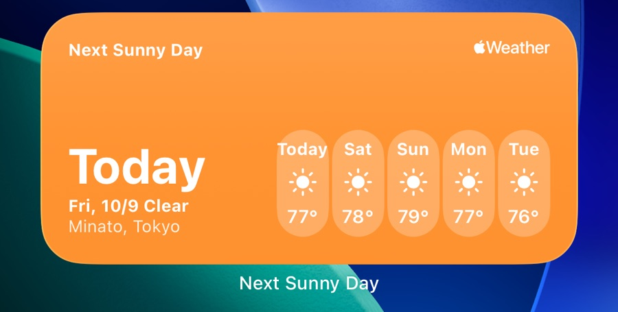

An iOS widget that shows the next sunny day on your home screen.
Weather widgets usually show only today and tomorrow, so it was hard to tell when you could hang your laundry outside.
The app shows when the next sunny day is, with today's weather beside it, the next 24 hours and ten days for up to three regions, and lets you choose what counts as sunny.
It can also notify you the day before a sunny day, and Siri and Shortcuts answer when the next sunny day is.
The app is available in English and Japanese.

<a href="https://apps.apple.com/app/id1537055268" style="display: inline-block; overflow: hidden; border-radius: 13px; width: 250px; height: 83px;"></a>

## Development

### Environment

| Tool | Version |
| --- | --- |
| Xcode | 27.1 |
| Swift | 6.4 (Swift 6 language mode) |
| iOS | 26.0 or later |

### Configuration

| Area | What it uses |
| --- | --- |
| UI | SwiftUI (Liquid Glass) |
| Widget | WidgetKit (Home Screen and Lock Screen) |
| Weather data | WeatherKit |
| Place search | MapKit |
| Notifications | UserNotifications (local notifications) |
| Siri and Shortcuts | App Intents (App Shortcuts) |
| Modules | Local Swift packages, one per module |
| State | Observation (`@Observable` state holders in the environment) |
| Concurrency | Swift 6, Approachable Concurrency |
| Local storage | App Group `UserDefaults` + JSON files |
| Tests | Swift Testing |
| Dependencies | None (Apple frameworks only) |
| Branching | `main` only |

The architecture decisions and their reasons are in [`docs/architecture/decisions/`](docs/architecture/decisions/).

### How it works

The app keeps the saved regions and the settings in `UserDefaults`, and each region's fetched forecast as a JSON file, both in an App Group container that the widget also reads.
A forecast counts as fresh when it was fetched since the last 4:00, by the app or the widget. The app fetches when it opens and the forecast isn't fresh, and on pull to refresh.
The widget shows the saved forecast. It reloads once a day after 4:00 and fetches from WeatherKit on its own when the saved forecast isn't fresh.
[`docs/architecture/weather-fetch-flow.md`](docs/architecture/weather-fetch-flow.md) has the details.

### Directory Structure

```
NextSunnyDay/               # The app
├── App/                    # App entry, AppFeatures, PreviewHost
├── SharedState/            # @Observable state holders shared by the screens
├── Home/  DayDetail/  Onboarding/  Region/  Settings/
├── Components/
├── Resources/              # String Catalogs (.xcstrings)
└── Assets.xcassets
NextSunnyDayWidget/         # The widget extension
NextSunnyDayTests/          # Tests of the app layer
Packages/
├── Core/                   # Weather, Location, PlaceSearch, AppGroup
└── Features/               # Region, Forecast, SunnyDay, Units
Tools/ImportCheck/          # CI check that every import is a declared dependency
docs/                       # Design spec, architecture docs and ADRs
```

## Set up

### Clone the project

```sh
$ git clone git@github.com:naipaka/NextSunnyDay-iOS.git
$ cd NextSunnyDay-iOS
```

### Weather data

Forecasts come from [WeatherKit](https://developer.apple.com/weatherkit/). No API key is needed to build.
To fetch real forecasts, the app and widget App IDs need the WeatherKit capability, and the team needs the WeatherKit App Service, both enabled in Certificates, Identifiers & Profiles. If you build with your own team, change the bundle identifiers and enable them for your App IDs.

### Formatting

Code is formatted and linted with the `swift-format` bundled with Xcode, using `.swift-format`. CI fails on lint warnings.

```sh
$ xcrun swift-format format -i -r -p NextSunnyDay NextSunnyDayWidget NextSunnyDayTests Packages Tools
$ xcrun swift-format lint --strict -r -p NextSunnyDay NextSunnyDayWidget NextSunnyDayTests Packages Tools
```

### Build and test

Open `NextSunnyDay.xcodeproj` in Xcode, then build and run the app. The app's tests run in the `NextSunnyDay` scheme; each package also tests on its own on the Mac:

```sh
$ for p in Packages/Core/* Packages/Features/* Tools/ImportCheck; do (cd "$p" && swift test); done
```

## Screenshots

| Screen | Light | Dark |
| --- | --- | --- |
| Home | 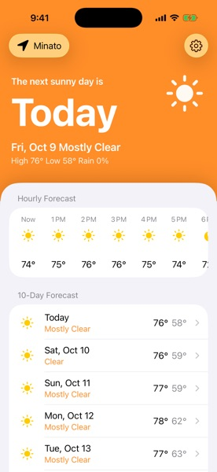 | 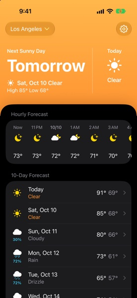 |
| Day detail | 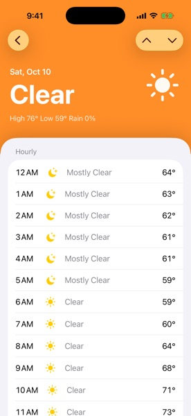 | 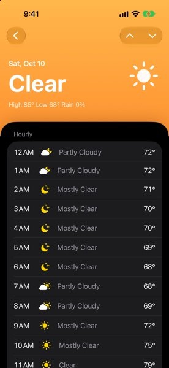 |
| Settings | 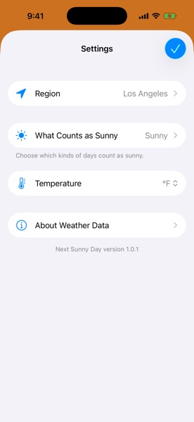 | 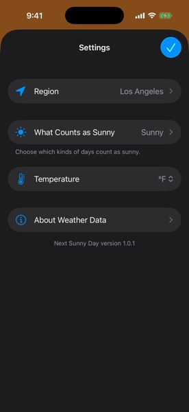 |
| Region search | 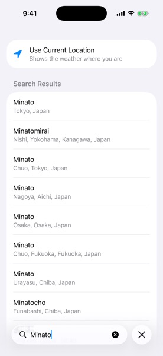 | 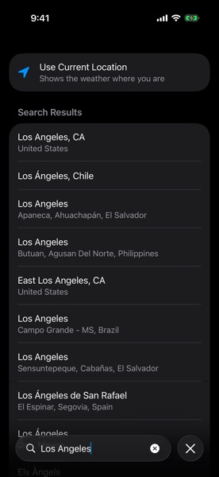 |
| About weather data | 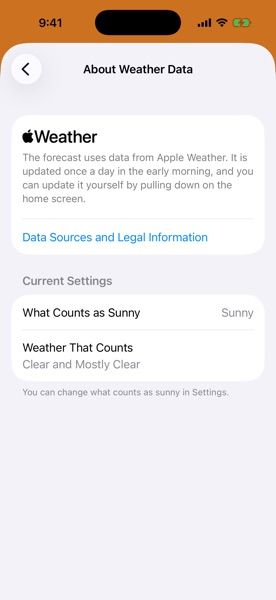 | 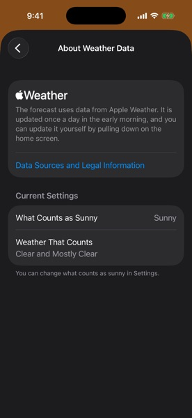 |
