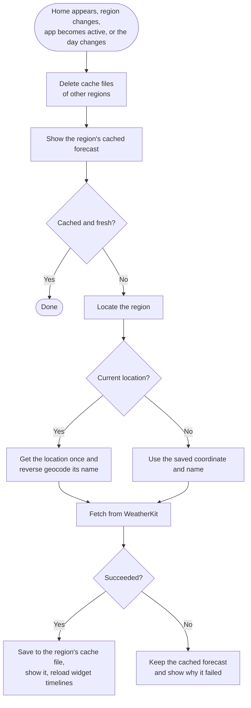
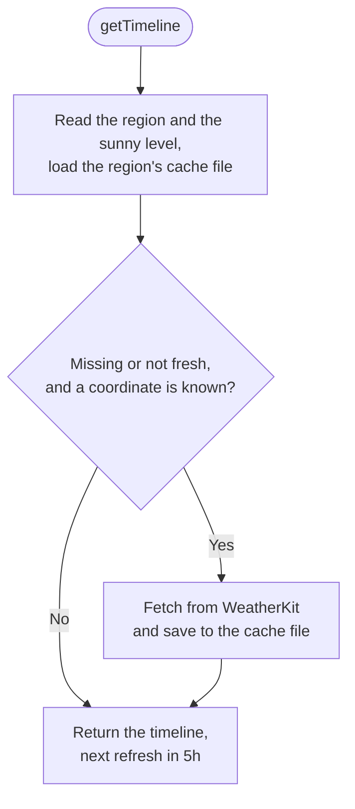

# Weather Forecast Fetch Flow

The app and the widget share their data through the App Group `group.com.naipaka.NextSunnyDay` (`AppGroupContainer` in the `AppGroup` package). There is no database:

| Data | Store (package) | Location |
| --- | --- | --- |
| Regions (`[SavedRegion]`, one entry for now) | `RegionStore` (`Region`) | App Group `UserDefaults`, key `regions` |
| The sunny level | `SunnyLevelStore` (`SunnyDay`) | App Group `UserDefaults`, key `sunnyLevel` |
| The last fetched forecast of each region (`CachedForecast`) | `ForecastCache` (`Forecast`) | `Library/Caches/forecasts/<region id>.json` in the App Group container |

Forecasts come from WeatherKit through `WeatherProviding` (`WeatherKitProvider` in the `Weather` package), which returns a `WeatherForecast`: ten days, their hours, and when the data expires. `ForecastUpdater` (`Forecast`) fetches it for a coordinate and caches it with the region's ID, place name and fetch time. Every successful fetch replaces the region's cache file as a whole (an atomic write). A failed fetch leaves the cached forecast as is.

## Storage rules

- **Settings are never migrated** ([ADR 0004](decisions/0004-stored-settings-format.md)). Every later version must read what earlier ones wrote, so `RegionStoreTests` and `SunnyLevelStoreTests` pin the stored format. Regions are a list from the start so that multiple regions need no format change.
- **Each region has an ID** given when it is added: a UUID for a searched place, the fixed `current-location` for the device location. Cache files are keyed by the ID, never by coordinates.
- **The cache is disposable.** A file that fails to decode, or was written with another `ForecastCache.formatVersion`, is deleted and fetched again. Files of regions that are no longer selected are deleted on the next refresh. The system may also purge the caches directory; that only costs a fetch.
- **Version 1 data is not migrated.** `LegacyRealmCleanup` deletes the old `db.realm*` files from the App Group container at launch, and the user picks the region again.

## When the app fetches

A cached forecast is **fresh** while WeatherKit's expiration date has not passed and it was fetched today ([ADR 0003](decisions/0003-forecast-freshness-and-current-location.md)). WeatherKit's daily and hourly data both expire one hour after they are fetched.

Home starts every fetch ([ADR 0005](decisions/0005-app-layer-state.md)). One `task(id:)` runs `RegionForecast.refreshIfNeeded(for:)` when Home appears, the selected region changes, the app becomes active, or the day changes (`significantTimeChangeNotification`). Pull to refresh and the retry buttons call `refresh(for:)`, which always fetches.

- A fetch cancelled because the region changed or the app left the foreground is not a failure; it runs again when needed.
- Without a cached forecast, a failure shows the "no data" state; with one, a banner above the cached forecast.

## Region selection

The Region screen searches while the user types (`.searchable` text in `@State`, `task(id:)` waits briefly and calls `RegionSearch.candidates(for:)`). Picking a result calls `RegionSelection.select(_:)`, which finds the place's coordinate and saves it as the only region with a new ID. "Use current location" saves the fixed `current-location` region. Home's `task(id:)` sees the new region and fetches; the old region's file is deleted in the same refresh.

## Widget timeline

`Provider.getTimeline` in `NextSunnyDayWidget` requests a refresh every 5 hours. It fetches a new forecast when the cached one is missing or not fresh, then builds the entry from the result. The widget doesn't use Core Location: for the current location it fetches for the coordinate of the last cached forecast. Its schedule and location handling are decided in #96.

