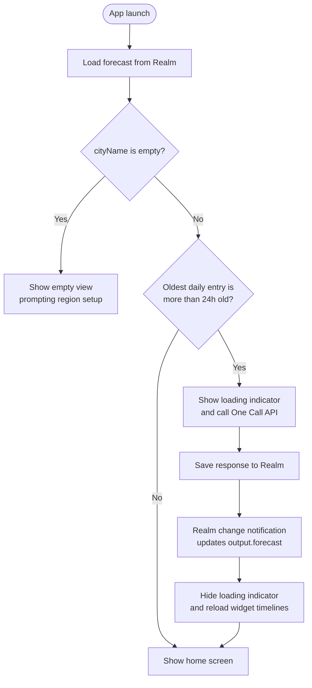
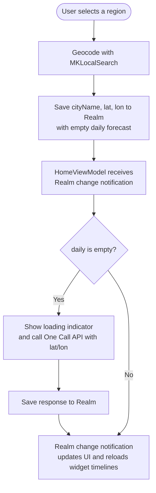
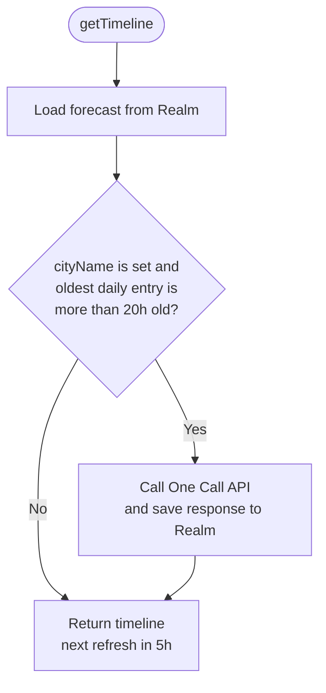

# Weather Forecast Fetch Flow

The forecast is stored in Realm (`DailyWeatherForecastEntity`) inside the App Group container, so the app and the widget read the same data. Views never read the API response directly: every fetch writes to Realm, and the UI updates from the Realm change notification.

## App launch

`HomeViewModel.init` decides whether the stored forecast is stale.

## Region selection

`RegionSelectionViewModel` geocodes the selected place and saves a new entity with no daily forecast. `HomeViewModel` sees an entity with empty `daily` and fetches it.

## Widget timeline

`Provider.getTimeline` in `NextSunnyDayWidget` requests a refresh every 5 hours. On each refresh it fetches a new forecast if a region is set and the oldest daily entry is more than 20 hours old.

