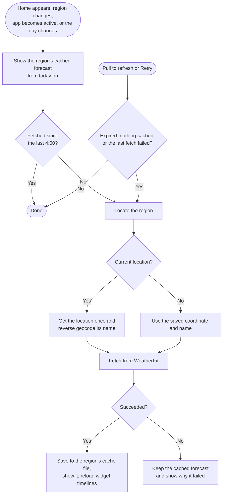
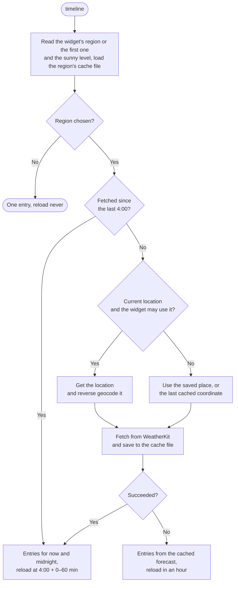
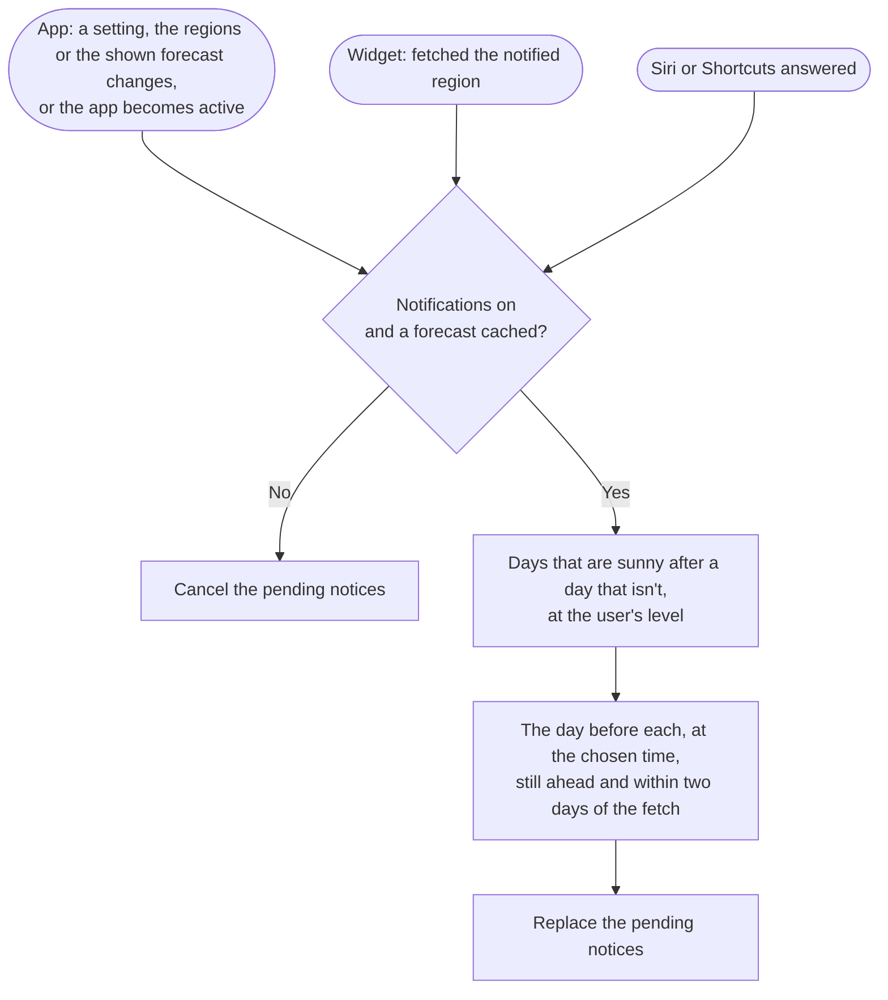

# Weather Forecast Fetch Flow

The app and the widget share their data through the App Group `group.com.naipaka.NextSunnyDay` (`AppGroupContainer` in the `AppGroup` package). There is no database:

| Data | Store (package) | Location |
| --- | --- | --- |
| Regions (`[SavedRegion]`, up to three, in the user's order) | `RegionStore` (`Region`) | App Group `UserDefaults`, key `regions` |
| The ID of the region Home shows | `RegionStore` (`Region`) | App Group `UserDefaults`, key `selectedRegion` |
| The sunny level | `SunnyLevelStore` (`SunnyDay`) | App Group `UserDefaults`, key `sunnyLevel` |
| The temperature unit (`system`, `celsius` or `fahrenheit`) | `TemperatureUnitStore` (`Units`) | App Group `UserDefaults`, key `temperatureUnit` |
| Whether notifications are on, their region and time (`noticeOn`, `noticeRegion`, `noticeTime`) | `NoticeSettingStore` (`Notice`) | App Group `UserDefaults` |
| The last fetched forecast of each region (`CachedForecast`) | `ForecastCache` (`Forecast`) | `Library/Caches/forecasts/<region id>.json` in the App Group container |

Forecasts come from WeatherKit through `WeatherProviding` (`WeatherKitProvider` in the `Weather` package), which returns a `WeatherForecast`: ten days, their hours, and when the data expires. `ForecastUpdater` (`Forecast`) fetches it for a coordinate and caches it with the region's ID, place name and fetch time. Every successful fetch replaces the region's cache file as a whole (an atomic write). A failed fetch leaves the cached forecast as is.

## Storage rules

- **Settings are never migrated** ([ADR 0004](decisions/0004-stored-settings-format.md)). Every later version must read what earlier ones wrote, so `RegionStoreTests`, `SunnyLevelStoreTests`, `TemperatureUnitStoreTests` and `NoticeSettingStoreTests` pin the stored format.
- **Each region has an ID** given when it is added: a UUID for a searched place, the fixed `current-location` for the device location. Cache files are keyed by the ID, never by coordinates.
- **The cache is disposable.** A file that fails to decode, or was written with another `ForecastCache.formatVersion`, is deleted and fetched again. Every saved region keeps its file; a region's file is deleted when the region is removed. The system may also purge the caches directory; that only costs a fetch.
- **Version 1 data is not migrated.** `LegacyRealmCleanup` deletes the old `db.realm*` files from the App Group container at launch, and the user picks the region again.

## When the app fetches

Only the region on screen is fetched: Home's region by the app, each widget's region by the widget, and the region asked about in Siri or Shortcuts by the app's intent. Saved regions that nobody looks at are not fetched in the background, so the calls per person stay about one a day however many regions are saved ([ADR 0006](decisions/0006-fetch-once-a-day.md)). A region that wasn't shown for a while shows its last forecast until its fetch ends.

A cached forecast is **fresh** when it was fetched since the last 4:00, by the app or the widget ([ADR 0006](decisions/0006-fetch-once-a-day.md)). WeatherKit's expiration (a flat hour after each fetch) only limits pull to refresh. Crossing midnight doesn't fetch: the cache holds ten days and their hours, so "today" moves to the next cached day.

Home starts every fetch ([ADR 0005](decisions/0005-app-layer-state.md)). Before its first frame, `onAppear` calls `RegionForecast.showCached(for:)`, which reads the region's cache file synchronously (`ForecastCache.load` is `nonisolated`; the file is small and replaced atomically), so a launch with a cached forecast shows it at once and the loading state appears only when nothing is cached. One `task(id:)` runs `RegionForecast.refreshIfNeeded(for:)` when Home appears, the shown region changes, the app becomes active, or the day changes (`significantTimeChangeNotification`, which only moves "today"). Pull to refresh and the retry buttons call `refresh(for:)`, which fetches when the expiration has passed, nothing is cached or the last fetch failed.

- A fetch cancelled because the region changed or the app left the foreground is not a failure; it runs again when needed.
- Without a cached forecast, a failure shows the "no data" state; with one, a banner above the cached forecast. Running out of WeatherKit calls looks the same: `WeatherService` doesn't report it apart from other failures.

## Region selection

`RegionSelection` holds a `RegionList` (`Region`): the saved regions in their order and the one Home shows, up to `RegionList.maximumCount` (three). It saves both through `RegionStore` on every change and reloads the widget timelines when the regions change.

- **Adding.** The Add Region screen searches while the user types (`.searchable` text in `@State`, `task(id:)` waits briefly and calls `RegionSearch.candidates(for:)`). Picking a result calls `RegionSelection.add(_:)`, which finds the place's coordinate and adds it with a new ID; "Use current location" adds the fixed `current-location` region. Either way the added region is shown. A region that is already saved (the same place, or the current location) is shown instead of added again.
- **Switching.** Home's region menu and the Regions screen call `RegionSelection.select(_:)`. Home's `task(id:)` sees the new region: the cached forecast shows at once, and a fetch runs only when it isn't fresh.
- **Removing.** `RegionSelection.remove(atOffsets:)` keeps at least one region, shows the first one when the shown region is removed, and deletes the removed regions' cache files (`ForecastUpdater.removeForecasts(except:)`).

## Widget timeline

`Provider.timeline(for:in:)` in `NextSunnyDayWidget` reads the widget's region, the sunny level, the temperature unit and the region's cache file, and fetches only when the forecast wasn't fetched since the last 4:00 ([ADR 0006](decisions/0006-fetch-once-a-day.md)). It returns two entries from the same forecast, now and the next midnight, so the day count rolls over without a reload. The next reload is at the next 4:00 plus a random 0–60 minutes; after a failed fetch, in an hour. Without a region the policy is `.never`: the app reloads the widgets when a region is chosen.

Each widget's region is its App Intent configuration (`SelectRegionIntent`, a parameter listing the saved regions as `RegionEntity` from the `RegionIntents` module). Until one is picked, and after the picked region is removed, the widget shows the first saved region (`RegionList.region(id:)`). Widgets showing different regions fetch separately, each at most once a day.

For the current location the widget looks the location up itself (`NSWidgetWantsLocation`, `isAuthorizedForWidgetUpdates`, five seconds at most). The system only gives a widget locations shortly after it was visible, so the 4:00 reload usually falls back to the coordinate and name of the last cached forecast.

## Siri and Shortcuts

`NextSunnyDayIntent` runs in the app's process, in the background. `AppFeatures.nextSunnyDayAnswer(regionID:)` picks the asked region, or the first saved one (`RegionList.region(id:)`), and calls `refreshIfNeeded(for:)` on a `RegionForecast` of its own: the region's cache is shown, and a fetch runs only when it wasn't fetched since the last 4:00, with the same location handling as Home. When the fetch fails (no network, or no location for the current location), the cached forecast answers; a successful fetch reloads the widget timelines like Home's ([ADR 0008](decisions/0008-app-intents.md)).

## Notifications

Notifications before a sunny day are scheduled from the cached forecast of one region: the first saved one, or the one chosen in the notification settings ([ADR 0009](decisions/0009-sunny-day-notifications.md)). Nothing is fetched for them; there is no background refresh.

- **What:** a notification at the chosen time (19:00 by default) the day before each day that counts as sunny after a day that doesn't, so a sunny spell is announced once (`NoticeSetting.notices(in:fetchedAt:now:calendar:isSunny:)`).
- **Only recent forecasts:** a notification goes out at most two days after its forecast was fetched; later ones aren't scheduled.
- **When they are scheduled again:** every scheduling replaces all pending notices (IDs starting with `sunny-day-`).

Opening a notification shows its region on Home. The system's notification settings for the app open the app's Notifications screen.

## Apple Watch

The watch has its own App Group container, so it keeps its own copy of the settings and its own forecast cache ([ADR 0010](decisions/0010-apple-watch.md)).

- **Settings.** The iPhone app sends the stored values of `regions`, `sunnyLevel` and `temperatureUnit` with WatchConnectivity's application context (`SettingsSync` in the `WatchSync` package) when they change, after its session activates, and when the watch app is installed. The watch writes them into its own `UserDefaults` under the same keys, reloads the complications, asks for new configuration recommendations and deletes the caches of removed regions. `selectedRegion` isn't sent: each device keeps the region it shows.
- **Forecasts.** The watch app fetches the region it shows with the iPhone's rules (`WatchForecast`): show the cache, fetch when it wasn't fetched since the last 4:00, retry by hand after a failure. The complications use the iPhone widget's `Provider` and fetch at most once a day. For the current location the watch app looks up the location; the complications use the coordinate of the last cached forecast, because watchOS widgets can't ask for it.

