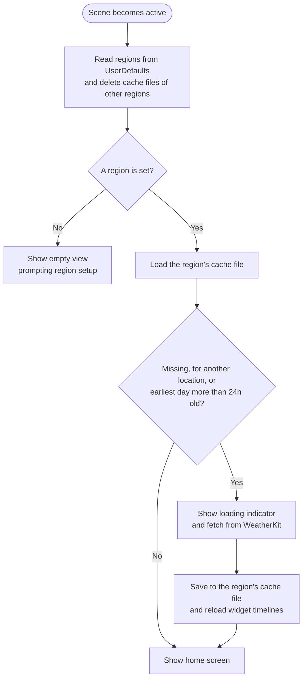
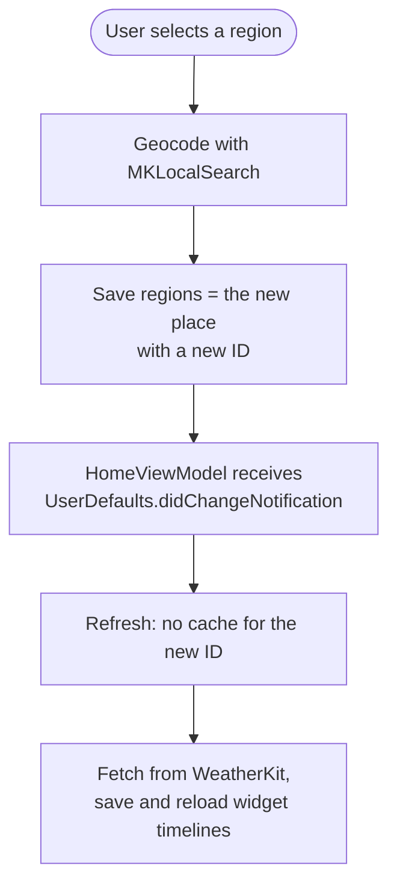
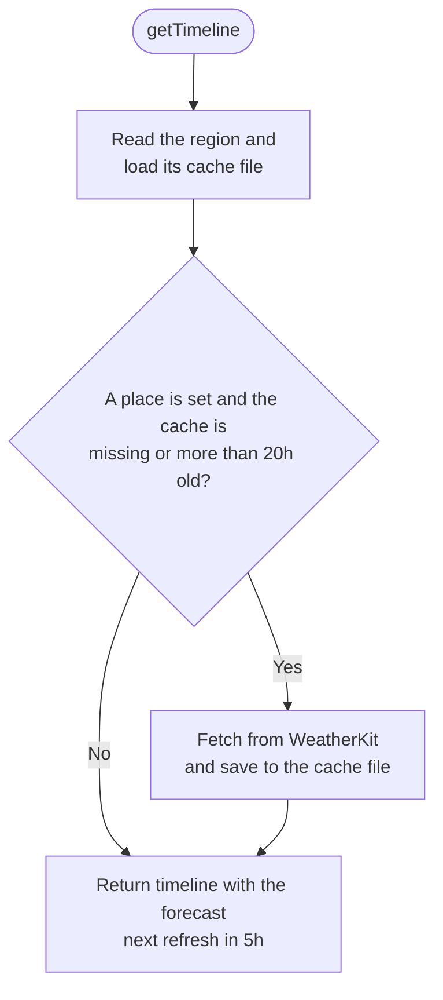

# Weather Forecast Fetch Flow

The app and the widget share their data through the App Group `group.com.naipaka.NextSunnyDay`. There is no database:

| Data | Store | Location |
| --- | --- | --- |
| Regions (`[Region]`, one entry for now) and the sunny level | `SettingsStore` | App Group `UserDefaults` |
| The last fetched forecast of each region (`ForecastSnapshot`) | `ForecastCache` | `Library/Caches/forecasts/<region id>.json` in the App Group container |

Forecasts come from WeatherKit through `WeatherProviding` (`WeatherKitProvider`), which returns a `ForecastSnapshot`: the location, the fetch time, the 10-day daily forecast and the hourly forecast for the same days. Every successful fetch replaces the region's cache file as a whole (an atomic write). A failed fetch leaves the cached forecast as is.

## Storage rules

- **Settings are never migrated.** Every later version must read what earlier ones wrote, so `SettingsStoreTests` pins the stored JSON. Regions are a list from the start so that multiple regions need no format change.
- **Each region has an ID** given when it is added: a UUID for a searched place, the fixed `current-location` for the device location. Cache files are keyed by the ID, never by coordinates.
- **The cache is disposable.** A file that fails to decode, or was written with another `ForecastCache.formatVersion`, is deleted and fetched again. Files of regions that no longer exist are deleted on the next refresh. The system may also purge the caches directory; that only costs a fetch.
- **Version 1 data is not migrated.** `LegacyRealmCleanup` deletes the old `db.realm*` files from the App Group container at launch, and the user picks the region again.

## App launch and return to the foreground

`HomeViewModel.refresh()` runs when the scene becomes active, which covers launch, and also catches a forecast the widget fetched while the app was in the background. The staleness check also catches a day change while the app was suspended.

## Region selection

`RegionSelectionViewModel` geocodes the selected place and saves it as the only region, with a new ID. `HomeViewModel` sees `UserDefaults.didChangeNotification`, finds that the region changed, and refreshes: there is no cache file for the new ID, so it fetches. The old region's file is deleted in the same refresh.

## Widget timeline

`Provider.getTimeline` in `NextSunnyDayWidget` requests a refresh every 5 hours. It fetches a new forecast if a searched place is set and its cached forecast is missing or the earliest day is more than 20 hours old, then builds the entry from the result.

The current location is not resolved yet (Core Location comes with #95/#96), so for it the app only refreshes the location it last fetched and the widget only shows the cache.
