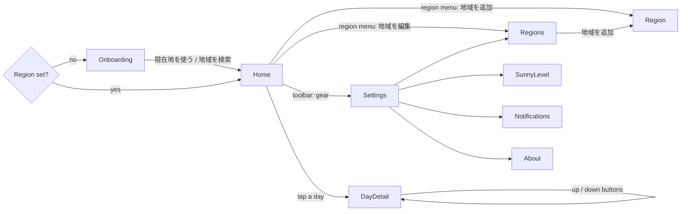
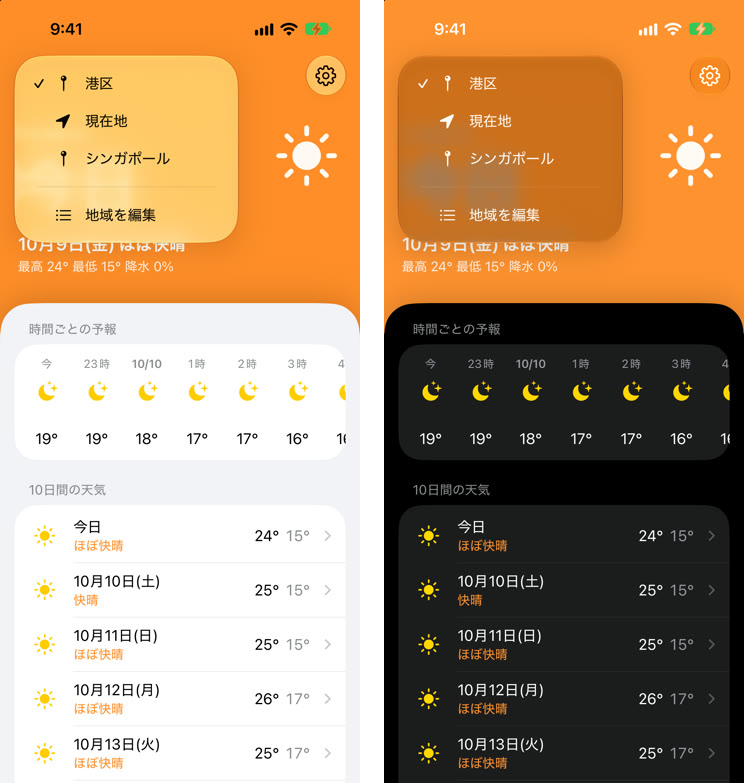
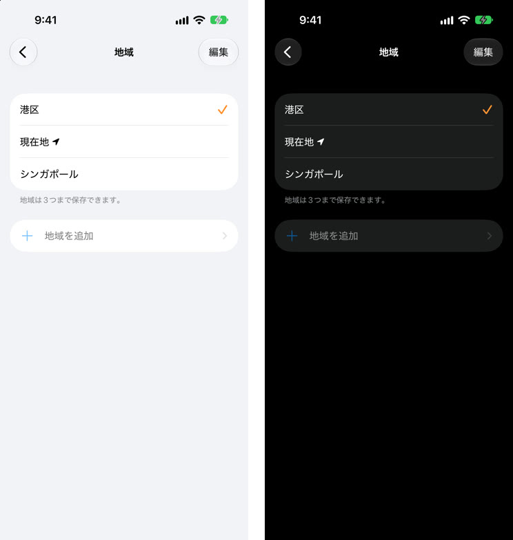
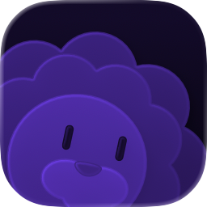
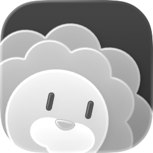

# NextSunnyDay 2.0 design spec

Approved design for the 2.0 revival (#93). The implementation tasks #94–#98 build from this document. The screenshots were taken on an iPhone 17 (iOS 26.4) simulator, so they show real SF Symbols, Liquid Glass and system colors. The screenshots and the values in this document are the source of truth. Each image puts light on the left and dark on the right. Sample data: Minato, Tokyo, on Wed 7 Oct, with the next sunny day on Sat 10 Oct.

## Decisions

| Topic | Decision |
| --- | --- |
| Regions | Up to three saved regions, found by search or "use current location" (Core Location); the current location is one of them, added and removed like a place. Home switches between them with a menu (#103). See [Regions](#regions). |
| Sunny definition | A user setting with four levels; the default matches v1. See [Sunny levels](#sunny-levels). |
| Hourly forecast | Home shows the next 24 hours as a horizontal strip, so the strip stays useful in the evening. Each day's hours are in the day detail screen, which opens from a row in the 10-day list. |
| Precipitation chance | Shown under the weather symbol in hourly cells and daily rows when it is 20 % or more. |
| Manual refresh | Pull to refresh on Home. |
| Widgets | Home Screen small, medium and large. Lock Screen circular, rectangular and inline. No Control Center control. |
| Siri and Shortcuts | One App Shortcut answers when the next sunny day is, for a saved region or the first one, with a dialog and a snippet (#104). See [Siri and Shortcuts](#siri-and-shortcuts). |
| Notifications | One notification the day before a sunny spell starts, for one region at a chosen time, from the cached forecast (#105). See [Notifications](#notifications). |
| Visual direction | Close to iOS 26 standard apps: system colors and materials, SF Symbols and grouped cards. System orange is the single accent and carries the "next sunny day" header. |
| Japanese tone | Friendly and casual, matching the app name 次いつ晴れる？ (e.g. 「次の晴れは あと3日」, 「まだ先かも」). |
| App icon | A close-up of the lion rising into the frame and looking up at the sky, redrawn from scratch and built in Icon Composer layers. See [App icon](#app-icon). |

## Visual language

- **System colors only.** Backgrounds use `systemGroupedBackground` and `secondarySystemGroupedBackground`; text uses `label`, `secondaryLabel` and `tertiaryLabel`. Don't hard-code hex values in code. The one accent is `Color.orange`, and it stays the system orange in dark mode (don't darken it). With Increase Contrast on, the header colors use their light variants in both appearances: the dark variants get lighter and drop the white header text to about 2:1, the light ones get darker and reach 4.5:1.
- **Weather symbols** are SF Symbols with the palette rendering mode. Clouds use `systemGray2` in light and white in dark; the sun and moon are yellow; rain drops and the precipitation chance are cyan. Symbols used: `sun.max.fill` (clear), `sun.min.fill` (mostly clear), `cloud.sun.fill` (partly cloudy), `cloud.fill`, `cloud.rain.fill`, `cloud.heavyrain.fill`, `cloud.drizzle.fill`, and the night variants `cloud.moon.fill` and `moon.stars.fill` in hourly cells.
- **Type.** Use system text styles so Dynamic Type works. The big "days until" number is the only display-size text (72 pt bold, scaled down to fit). Section headers are `subheadline` in `secondaryLabel`, regular weight. Rows are `body` with a `subheadline` secondary line.
- **Shapes.** Cards have a 26 pt continuous corner radius. The content sheet's top corners are 34 pt.
- **Liquid Glass is for controls only:** toolbar buttons, the confirm button in sheets, and buttons such as Retry or "Use current location". No custom glass in the content layer.

## Navigation

Settings is a sheet with its own navigation stack. The day detail screen is pushed onto the Home stack.

## Home

- **Toolbar** (system glass): a region menu on the leading side and a gear button on the trailing side. The menu's button shows the region name and a small `chevron.down`, with `location.fill` before the name only when the current location is shown. See [Regions](#regions).
- **Header.** A full-bleed color area at the top of the scrolling content:
  - System orange when a sunny day is in range, `systemGray` when none is, and `systemGray2` while loading or when there is no data.
  - Text from top to bottom: 「次の晴れは」 (`headline`), the big 「あと3日」, the date and condition (`title3` semibold), then high / low / precipitation (`subheadline`).
  - A 64 pt white symbol sits at the top trailing corner.
- **Content sheet.** It overlaps the bottom of the header, and both scroll together (a stretchy header):
  - The sheet starts 34 pt above the bottom of the header and has 34 pt top corners and a soft upward shadow (black at 18 %, radius 18, y −4).
  - Scrolling up, the header fades out over 70 % of its height and moves up at 0.3× the scroll speed (parallax), so the sheet slides over it. Once the sheet reaches the top, the toolbar floats over the sheet with the system scroll edge effect, and no header color is left behind it.
  - Pulling down stretches the header color into the space above it; the header text moves down with the content. The refresh control shows on the header color.
- **時間ごとの予報** card: a horizontal strip of the next 24 hours with time, symbol, precipitation chance and temperature. The first cell is 「今」; the first hour of the next day shows its date (「10/9」) instead of 「0時」. The screenshots predate this and show 「今日の時間ごと」 with today's hours only.
- **10日間の天気** card. Each row shows:
  - the symbol, with the precipitation chance under it
  - the date (「今日」, then 「10月8日（木）」…)
  - the condition on a second line, in orange on sunny days
  - the high and the low (the low in `secondaryLabel`)
  - a chevron
  Tapping a row opens the day detail screen.
- **Footer:** the last-updated time, the Apple Weather mark and the 「データソース」 legal link.

### Header copy

| State | Big text | Line 2 | Line 3 | Color / symbol |
| --- | --- | --- | --- | --- |
| Sunny day in N ≥ 2 days | あと{N}日 | {M}月{D}日（{曜}）{condition} | 最高 {H}° 最低 {L}° 降水 {P}% | orange / day symbol |
| Tomorrow | あした | same | same | orange |
| Today | 今日 | same | same | orange |
| None in the 10-day range | まだ先かも | 10日先まで晴れの予報なし | 予報が変わったらここに出るよ | `systemGray` / `cloud.fill` |
| No data (fetch failed, nothing cached) | あと？日 | 天気を取得できなかったよ | 「もう一度試す」 button | `systemGray2` / `icloud.slash.fill` |
| Loading (first fetch) | spinner + 天気を取得中… | — | — | `systemGray2`; the sheet is redacted |

The 「今日」 and 「あした」 rows were not mocked; they follow the same layout.

### States

| No sunny day in range | Loading |
| --- | --- |
|  |  |

| Refresh failed, cached data shown | Fetch failed, no data |
| --- | --- |
|  |  |

- **Refresh failed with cached data:** keep the cached forecast. Add a banner card at the top of the sheet: 「天気を更新できなかったよ」, 「今日 14:05 の予報を表示しています」 and a 「再試行」 glass button.
- **Fetch time** in the banner and the Home footer (「今日 14:05 に更新」) uses the system's relative date for the language: 「今日」, 「昨日」 and 「一昨日」 in Japanese, then the date (「2026/10/05 14:05」). The cache can be a day or more old, because the forecast is fetched once a day from 4:00 and may fail offline. The widget's 「前回の更新」 uses the same format.
- **Fetch failed with no data:** the header shows 「あと？日」 with a 「もう一度試す」 button. The sheet holds a single card: 「通信できる場所で、もう一度試してね」 with a short explanation and a hint about pull to refresh.

## Onboarding (no region yet)

A `ContentUnavailableView`: a multicolor sun, 「どこの天気を調べる？」 and 「地域を決めると、次に晴れる日がわかるよ。」. There are two buttons: 「現在地を使う」 (orange, glass prominent) and 「地域を検索」 (glass). The navigation title is 次いつ晴れる？.

## Day detail

| Top | Scrolled |
| --- | --- |
|  |  |

- It uses the same layered layout as Home. The header is orange on a sunny day and `systemGray` otherwise. It shows the date (`headline`), the condition as the big text, then high / low / precipitation, with the day's symbol at the top trailing corner.
- The toolbar has the system back button, plus up/down buttons (`chevron.up` / `chevron.down`) that move to the previous or next day.
- **時間ごと** card: one row per hour with time, symbol, condition, precipitation chance (20 % or more) and temperature.
- **その他** card: sunrise, sunset, UV index and wind, each with a multicolor symbol.
- The footer has the same attribution as Home.

## Settings

| Settings | 晴れの基準 |
| --- | --- |
|  |  |

- A sheet with an inline title 「設定」 and a confirm button (`Button(role: .confirm)`).
- The rows are:
  - 地域 (`location.fill`, value = the region Home shows, 「港区」 or 「現在地」), which opens [地域](#regions)
  - 晴れの基準 (`sun.max.fill`, value = the current level), with the footer 「どんな天気の日を「晴れ」として数えるかを選べるよ。」
  - 通知 (`bell.fill`, value = the time, 「19:00」, or 「オフ」), which opens [通知](#notifications)
  - 気温 (`thermometer.medium`, value = the unit in use, 「°C」 or 「°F」), a menu picker with the choices of Apple's Weather app, in its order: 「摂氏（°C）」, 「華氏（°F）」 and 「システム設定を使用（°C）」 (the default: the system's temperature unit, shown in the parentheses, which follows the region unless changed in Settings > General > Language & Region). It applies to the app and the widgets.
  - 天気データについて (`info.circle`)
- The version string goes in the last footer.
- **晴れの基準** is a list of the four levels. Each row has a symbol, a title and a subtitle listing what counts by the condition names Home shows (WeatherKit's, such as 「快晴、ほぼ快晴」; the loosest level keeps its description instead of listing nine), and the selected row has an orange checkmark. The footer recommends 「雨が降らなければOK」 for laundry.

### Sunny levels

The levels are cumulative. Both the next-sunny-day search and the orange "sunny" styling use the selected level.

| Level (UI) | Counts as sunny (`WeatherCondition`) | Extra rule |
| --- | --- | --- |
| 快晴だけ | `.clear` | — |
| 晴れ (default, same as v1) | `.clear`, `.mostlyClear` | — |
| 晴れ時々くもりまで | + `.partlyCloudy` | — |
| 雨が降らなければOK | + `.mostlyCloudy`, `.cloudy`, `.haze`, `.breezy`, `.windy`, `.hot`, `.frigid` | daily precipitation chance < 30 % |

Fog, smoke, blowing dust, every kind of precipitation and every storm never count. The home copy stays 「次の晴れは」 at every level.

## Regions

| Home's region menu | 地域 |
| --- | --- |
|  |  |

- **Up to three regions.** The current location counts as one of them.
- **The region menu** on Home lists the saved regions in their order, the shown one checked, with `mappin` for places and `location.fill` for 「現在地」. Below a divider: 「地域を追加」 (`plus`, only while fewer than three are saved) and 「地域を編集」 (`list.bullet`). Choosing a region shows it on Home at once, from its cached forecast when there is one.
- **地域** (pushed from 「地域を編集」 or from the Settings row) lists the regions as plain rows; the current location reads 「現在地」 with `location.fill` after it and its place name below when known. The shown region has an orange checkmark, and tapping a row shows that region and goes back. 「編集」 deletes and reorders (the last region can't be deleted); the order is the menu's order. The footer reads 「地域は3つまで保存できます。」, and 「地域を追加」 below it is disabled at three regions.
- **Saving a place twice** chooses the saved one instead of adding it again.

## Region (adding a region)

- The title is 「地域」 during onboarding and 「地域を追加」 afterwards.
- The first row is 「現在地を使う」 (`location.fill` in blue, subtitle 「今いる場所の天気を表示します」); it is hidden when the current location is already saved.
- Below it is a 「検索結果」 section that updates while the user types (#28). Each result shows a place name and a gray subtitle, and saved places have an orange checkmark.
- Search uses `.searchable`; on iOS 26 the field sits at the bottom.
- Results are areas only: prefectures, cities, wards and towns (「港区」, 「湊」), never street addresses or buildings.
- Choosing a result or the current location adds it, shows it on Home and goes back.

## About weather data

- The Apple Weather mark (`WeatherService.shared.attribution`), a short note on the data and refresh, and the 「データソースと法的情報」 link.
- A 「いまの設定」 section shows the selected sunny level and which conditions count.

## Notifications

- **When.** One notification the day before a day that counts as sunny at the selected level, when that day before doesn't: once when a sunny spell starts, not every evening of a sunny week. It goes out at the chosen time, 19:00 by default.
- **Which region.** One: the first saved region until another is chosen, and again after the chosen one is removed.
- **Only recent forecasts.** Nothing is fetched for notifications. They follow the cached forecast, which the app, the widget and Siri update, and a notification goes out at most two days after its forecast was fetched.
- **通知** (pushed from Settings, inline title 「通知」):
  - 「晴れの前日に通知」, a switch, off by default.
  - While it is on: 「地域」, a menu of the saved regions, and 「時刻」, a time picker (hours and minutes).
  - Footer: 「晴れそうな日の前日、この時刻にお知らせするよ。晴れが続くあいだはお休みするよ。」
  - When the system doesn't allow the app's notifications, the switch shows off and a section below it has 「設定を開く」 (the app's notification settings) with the footer 「通知がオフになっているよ。受け取るには設定でオンにしてね。」
- **Permission** is asked when the switch is turned on, not at launch. The system's notification settings for the app link to this screen.
- **Copy:**

  | Part | Japanese | English |
  | --- | --- | --- |
  | Title | 港区 (the region's name; 「現在地」 before the current location's name is known) | Minato |
  | Body | あしたは晴れそう！快晴で、最高 24° 最低 16° だよ。 | Good news: sunny tomorrow! Clear, with a high of 24° and a low of 16°. |
  | With previews hidden | あしたの天気 | Tomorrow's weather |

  Temperatures are in the unit set in the app. The body says 「晴れそう」, not 「晴れる」: it is a forecast.
- **Opening it** shows that region on Home. While the app is open, a notification goes to Notification Center without a banner.

## Attribution

The Apple Weather mark and the legal link appear in three places: the Home footer, the day detail footer and About. The mockups use a dashed placeholder; the real mark comes from `WeatherService.shared.attribution`, in its light and dark variants. The medium and large widgets also show the mark; the small and Lock Screen widgets have no room for it, and the legal link stays in the app (#96).

## Widgets

| Home Screen | States | Lock Screen |
| --- | --- | --- |
|  |  |  |

- **Small:** 「次の晴れ」 with a symbol, 「あと3日」, 「10/10（土）快晴」 and the region name.
- **Medium:** the small layout plus the next five days (weekday, symbol, high). Sunny days get a light capsule behind them.
- **Large:** a header row like the small widget, then seven days (date, symbol, condition, high/low). Sunny rows are bold on a light capsule.
- **Background:** system orange when a sunny day is in range, `systemGray` otherwise.
- **States:**
  - None in range: 「まだ先かも」 / 「10日先まで晴れなし」. The medium widget still lists five days.
  - No data: 「あと？日」 / 「天気を取得できなかったよ」. The small widget adds 「タップして更新」; the medium widget adds the last update time.
- **Lock Screen:**
  - inline: 「☀ 次の晴れ あと3日（土）」; 「今日」 and 「あした」 go without the weekday. In English each state is its own short sentence to fit the line above the clock: "Sunny in 3 days (Sat)", "Sunny today", "Sunny tomorrow", "No sunny day soon", "Sunny in ? days".
  - circular: the symbol over 「3日」
  - rectangular: 「次の晴れ」 / 「あと3日」 / 「10/10（土）快晴」
  The system draws these in monochrome.
- The mockups are plain views at widget sizes, not a real widget extension. In the accented and clear Home Screen looks the system replaces the orange or gray background with its own material; the headline and the symbol are the accented parts.
- **Region:** each widget has a 「地域」 setting (Edit Widget) listing the saved regions. Until one is picked, and after the picked region is removed, it shows the first region in the app's list (#103).
- A widget without a region says 「あと？日」 / 「アプリで地域を選んでね」. The medium and large widgets draw their days redacted, where the forecast goes once a region is chosen.

## Siri and Shortcuts

- **One intent, 「次の晴れ」** ("Next Sunny Day"), shown as an App Shortcut in Spotlight and the Shortcuts app with `sun.max`. It takes an optional region (the saved regions); without one, or after it was removed, it answers for the first region in the list, like the widget. The sunny level is the one set in the app.
- **Phrases.** Each one asks the app to do something. A phrase that reads as a weather question, such as the app's name 「次いつ晴れる？」 alone or 「札幌市は次いつ晴れる？」, is answered by Siri's own weather on a device, so those aren't used.

  | Japanese | English |
  | --- | --- |
  | 次いつ晴れる？で次の晴れを調べて | Check Next Sunny Day |
  | 次いつ晴れる？で{地域}の次の晴れを調べて | Check Next Sunny Day for {region} |
  | 次いつ晴れる？で調べて | Ask Next Sunny Day |

  The first time Siri runs one, it asks whether to turn on the app's shortcuts.
- **Dialog,** in the wording of Home's header and the widget. The date is spoken in full (「10月10日 土曜日」).

  | State | Japanese | English |
  | --- | --- | --- |
  | In N days | 港区の次の晴れは あと3日、10月10日 土曜日、快晴だよ。 | The next sunny day in Minato is Saturday, October 10, in 3 days: Clear. |
  | Tomorrow | 港区は あした晴れそう。10月8日 木曜日、快晴だよ。 | Minato should be sunny tomorrow, Thursday, October 8: Clear. |
  | Today | 港区は 今日晴れそう。快晴だよ。 | Minato should be sunny today: Clear. |
  | None in range | 港区は 10日先まで晴れの予報がないよ。まだ先かも。 | No sunny day in Minato in the next 10 days. |
  | No data | 天気を取得できなかったよ。通信できる場所で、もう一度試してね。 | Couldn't get the weather. Try again where you have a connection. |
  | No region | アプリで地域を選んでね。 | Choose a region in the app. |

  The current location is named by its place name when it is known, and 「現在地」 otherwise.
- **Snippet:** the small widget's layout on a card with a 26 pt corner radius: 「次の晴れ」 and the symbol, the big 「あと3日」, the date and condition (`headline`), high, low and precipitation (`subheadline`), and the region name. Orange when a sunny day is in range, `systemGray` when none is, `systemGray2` without data or a region (「あと？日」 with 「天気を取得できなかったよ」 or 「アプリで地域を選んでね」).
- The intent fetches only when the region's forecast wasn't fetched since the last 4:00, and answers from the cache when the fetch fails.

## App icon

The icon is the lion's face rising into the frame from the bottom left and looking up at the sky to the top right, waiting for the next sunny day. The lion is redrawn from scratch rather than traced from v1, so that it holds up next to the system apps.

| Light | Dark | Tinted light | Tinted dark | Clear light | Clear dark |
| --- | --- | --- | --- | --- | --- |
|  |  |  |  |  |  |

- **Crop:** the lion overflows the frame, so the face reads at Home Screen size; the sky in the top right is where it looks. The face is turned toward the sky by shifting the eyes, nose and muzzle up and to the right and tilting the head.
- **Shapes:** few large shapes, no outlines. The mane is two rings of nine large lobes; the face is a soft disc with a white muzzle. Ears are left out: in the mane they made the head read as a bear.
- **Face:** short vertical line eyes without catchlights, which vanish at small sizes. The nose is a small rounded light brown shape on top of the muzzle; a dark triangle nose read as an open mouth from a distance.
- **No text:** no "?" or other text in the icon, as the HIG advises.
- **Colors:** a blue sky that gets lighter toward the horizon, so the orange mane stands out. Every shape has a gentle top-lit gradient.

The icon is [`NextSunnyDay/AppIcon.icon`](../../NextSunnyDay/AppIcon.icon), an Icon Composer document. Its layers are plain SVG shapes in `Assets/`; the colors and gradients are set in `icon.json`:

| Group (front to back) | Layers | Fill |
| --- | --- | --- |
| Features | `eyes`, `nose` | Dark brown #3A1806; light brown #E3A47C |
| Face | `muzzle`, `face` | White to #FFE7C2; #FFF0BE to #FFC24A |
| Mane | `mane-front`, `mane-back` | #FFB547 to #F47A1C; #FF9A2E to #E0540C |
| Background | | Sky, #2F86E6 at the top to #8CCBFF at the bottom |

- **Dark:** a night sky (#0E1530 to #28365F), with the face and mane a little deeper. The lion keeps its colors, so the icon is recognizable in every appearance.
- **Tinted and clear:** left to the system, which keeps the shapes and drops the colors.
- The previews in [`app-icon/`](app-icon/) and [`app-icon-1024.png`](app-icon-1024.png) are rendered from the document with `ictool` (inside Icon Composer.app): `ictool NextSunnyDay/AppIcon.icon --export-image --output-file light.png --platform iOS --rendition Default --width 256 --height 256 --scale 1`. The renditions are `Default`, `Dark`, `TintedLight`, `TintedDark`, `ClearLight` and `ClearDark`.

## Implications for later tasks

- **#94 Storage**
  - Store the region as a name plus coordinates, or a "current location" flag.
  - Store the sunny level (default 晴れ).
  - Store the cached daily forecast (condition, high/low, precipitation chance, sunrise/sunset, UV, wind) and hourly forecast.
  - Store the last successful fetch time; the error banner and the widget need it.
- **#95 App layer**
  - Screens: Onboarding, Home, Day detail, Settings (sheet), Region, Sunny level, About.
  - Header states: sunny / none / loading / no data, plus the cached-data error banner.
  - The next-sunny-day logic takes the sunny level, including the 30 % rule.
  - Pull to refresh, and incremental region search with "use current location" (Core Location, when-in-use).
- **#96 Widgets**
  - Families: small, medium, large, `accessoryInline`, `accessoryCircular`, `accessoryRectangular`.
  - States: sunny, none in range, no data.
  - Show the region name.
  - Check whether widgets need attribution.
- **#97 Visuals**
  - The layered header and sheet: overlap, corner radius, shadow, fade and parallax values as above.
  - The SF Symbols palette mapping, system colors with only the orange accent, and glass on controls only.
  - The app icon is done in #110 (see [App icon](#app-icon)).
- **#98 English**
  - Every string in this spec gets an English source string. The Japanese above is the `ja` translation.
  - The English app name is "Next Sunny Day" (home screen, widget gallery, Settings).
